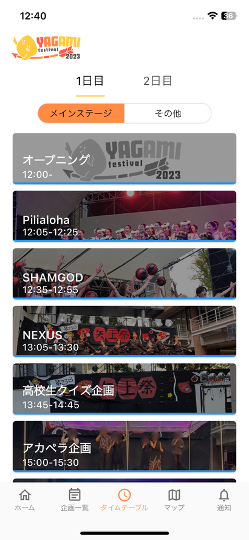
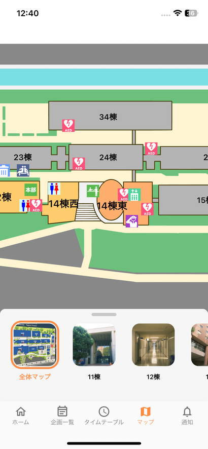

# Yagamy

Yagamy is a mobile app that was released in 2023. This app was used at Yagami Festival (the school festival at Yagami Campus, Keio University). Developed using Flutter, and released to both App Store for iOS and Google Play for Android.
The data for each project was fetched from MongoDB and Amazon S3. Users were able to receive notifications in real time (using Firebase).

# Features

- Projects
  - The details of all projects in the festival.
- Timetable
  - The timetable of two stages.
- Map
  - An interactive map showing where each project is located.
- Notification
  - Real-time notifications are displayed on this page.

# Gallery

